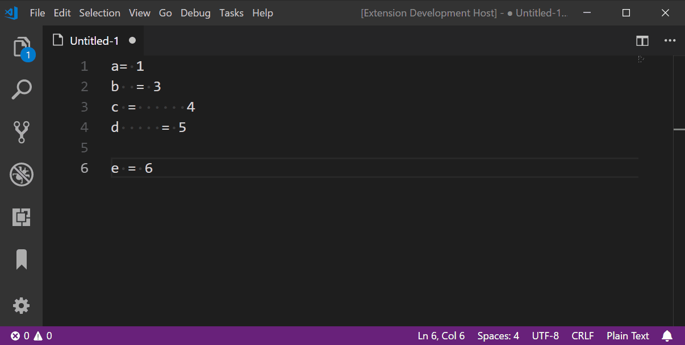
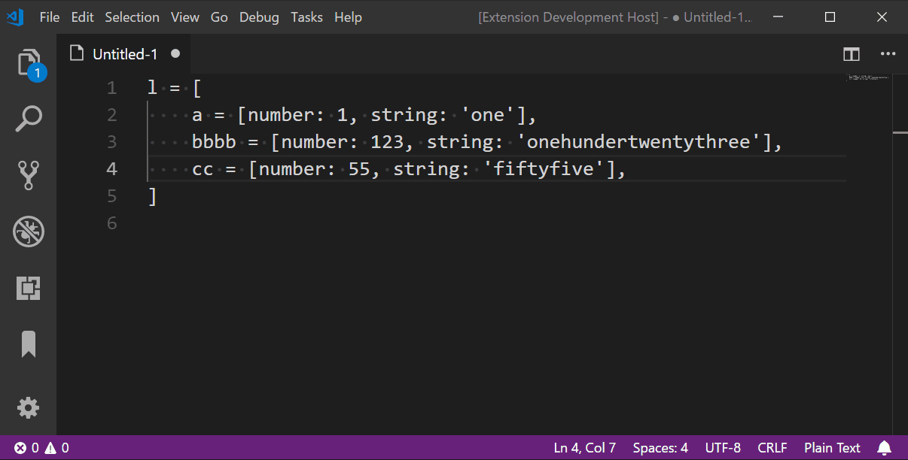

# align-by-regex README

With this extension multiple lines of text can be aligned by a regular expression.

## Features

- Align multiple lines of text by regular expressions.
- Store regular expressions as templates for repeated use (Usage: Type the name of the template instead of the regular expression).

## Examples

## Extension Settings

This extension contributes the following settings:

* `align.by.regex.templates`: Map which can hold user specified regular expression templates (i.e. `"align.by.regex.templates": { "abc": "=|,|:"}` ).

## Contributors

* [Carl](https://github.com/softwareape)

## Release Notes

### 1.0.2

Multiple alignment isses have been fixed.

### 1.0.1

Minor Bugfixes.

### 1.0.0

Initial release of align-by-regex.
